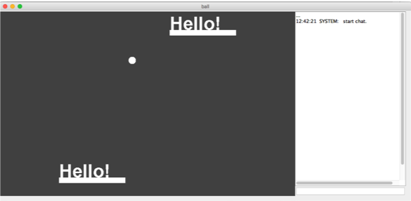
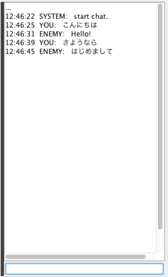

# PONG_Online
あの"ポン"がオンラインで遊べるようになりました！

と言いたいところだけどシンプルすぎなので、余計な機能として  
* チャット機能  
* チャットメッセージがラケットになって打ち返すと消える(のでチャットが強制的に進む)  
  
というものがついてます。

### ゲーム画面
右ペインがチャットで、チャットで送った文字がラケットになってます。打ち返すと消えます。これにより2人は負けないためにはチャットを続けざるを得ません。  

### チャット拡大図

## 概要
( <http://threepipes.hateblo.jp/entry/2015/02/23/215343#fn-917a7738>のthreepipesさんの作ったブロック崩しをベースに作成しました。
リポジトリはこっち<https://github.com/threepipes/breakout/tree/master/Breakout/src/breakout>)  
  
PONG_Onlineは、クライアントとサーバモードがあり、サーバ側がほとんどゲームの処理をして、クライアントは送られきたデータで画面を描きます。

## 使用方法
Eclipseのgit機能でリポジトリをクローンしてくれれば使えます。  

ターミナルなどで使う場合は以下の通り...  
srcディレクトリに移ります  
`$cd PONG_ONLINE/src`  
コンパイルします。  
`$javac breakout/*.java`    
実行します。  
`$java breakout.Main`  
あとはウィンドウが出てくるので、ポート番号やら接続先ホスト名やらを入れて好きなモードのボタンを押してください。  
  
なお、クライアントモードは、注意点にもあるように接続先のホストが存在しない場合、すぐ終了してしまいます。  

## 注意点
クライアントモードは、接続先のホストが存在しない場合、すぐ終了してしまいます。

また、接続先は現在ホスト名から探すようにしてあります...  
つまり名前解決できないとダメです  

同じブロードキャストドメイン内であれば、Windows同士の場合だとNetBIOSの機能か何かでブロードキャストで探してくれるみたいで何もしなくても良いんですが...  

そのうちIPアドレスを直打ちにも対応したいと思います。

## 遊び方
左右矢印キーで移動。落としたらゲームオーバー。  
入力したチャットメッセージがラケットになり、一回打ち返すと消えます  
なのでチャットを送らないでいるとラケットが無いままになり負けます
  
  
----------------
# Gitの操作方法(開発メンバー向け)
コミットとプッシュは、ワンセットで行なう感じで...。  ワンセットで行わなくても良いですが、わりと高頻度でプッシュしてください。お互いの作業状況が把握しやすいと思います。  
### ブランチを作る
`$cd ~/class/PONG_ONLINE`  
などとして、クローンしたディレクトリに移動します。なお、上は例であり、クローンしたディレクトリのパスを自分で入れてください。  
`$git checkout master`  
として、マスターブランチに移動します  
`$git pull`  
とやって、**リモートリポジトリの最新のバージョンに内容を同期します。** これをやらないと最新バージョンからブランチできないのでマージのときにめんどくさいです  
`$git branch ブランチ名`   

  として、ブランチを作成します。一つのリモートリポジトリを共有して複数人で開発するので、<ユーザ名>-<トピック名>という形が望ましいと思います。例としては、TT375S-chatLog　といったような感じ。  
`$git checkout さっき作ったブランチ名`  
とやってさっき作ったブランチに移動します。  

### 変更をローカルリポジトリに記録する(= コミット)
何か変更を加えたあとに、  
`$cd ~/class/PONG_ONLINE`  
などとして、クローンしたディレクトリに移動します。なお、上は例であり、クローンしたディレクトリのパスを自分で入れてください。  
`$git add .`  
とすると、全てのファイルに関して、変更がステージングエリア(次のコミットに反映される内容、みたいなもん)に追加されます。(ファイル名を指定することもできる)  
`$git commit -m 'ここにコメントを入れる！'`  
とすれば、ローカルリポジトリにコミットされます。  
この時点では、自分のPCに保存されているローカルリポジトリにしか影響がなく、リモートリポジトリ(githubのコレ)には影響がありません。

### ローカルリポジトリの変更をリモートリポジトリに記録する(= プッシュ)
コミットしたあとに、   
`$cd ~/class/PONG_ONLINE`  
などとして、クローンしたディレクトリに移動します。なお、上は例であり、クローンしたディレクトリのパスを自分で入れてください。  
`$git push`  
とすると、ローカルリポジトリの変更がリモートリポジトリ(githubのここ)に反映されます。  

